# MicroLabxAI
A central bridge device that connects your computer (AI) with electronic hardware such as sensors, cameras, robotic tools, and measurement devices. Built on a microcontroller architecture and powered by MicroPython, it enables efficient, low-cost, and flexible hardware integration.

The system unifies all connected components into a single intelligent workspace, allowing AI to read data, analyze it, and control devices in real time. By combining embedded hardware with a lightweight Python-based environment, MicroLabxAI makes it easy to build, experiment, and automate electronic systems.

In simple terms, it transforms your setup into a smart, AI-driven hardware lab where devices can communicate, respond, and operate together seamlessly.

## Architecture

```mermaid
graph TD
    subgraph "Host Layer"
        A[REPL / mpremote / AI Agent / Future SDK]
    end

    subgraph "MicroLabxAI Runtime (Device)"
        B[mlx.py — Public API]

        subgraph "Core Layer"
            C[device/core/registry.py — Module Registry]
            D[device/core/board.py — Load Board Profile + Capabilities]
            E[device/core/base.py — Strict BaseModule Contract]
        end

        subgraph "Modules Layer"
            F[device/modules/ads1115.py<br/>device/modules/light.py<br/>device/modules/bme280.py<br/>...]
            G[device/modules/_registry.json — Single source of truth]
        end

        subgraph "Drivers Layer"
            H[device/drivers/i2c/ads1115.py<br/>device/drivers/gpio/light.py<br/>device/drivers/spi/...<br/>device/drivers/network/...]
        end

        subgraph "Workspace Layer"
            I[device/workspace/handle.py — WorkspaceHandle]
            J[device/workspace/manager.py — Lifecycle]
            K[device/workspace/store.py — .mlx/ Persistence]
        end

        B --> D
        D --> C
        C <--> G
        G --> F
        F --> E
        F --> H
        F <--> I
        I <--> J
        I <--> K
    end

    A --> B
    H --> Hardware[Current Board<br/>ESP32-S3 WROOM-1<br/>or STM32, RP2040, etc.]
```

